# Introduction: Choosing good indicators for peacebuilding impact evaluations

Conducting impact evaluations of peacebuilding projects is a notoriously hard challenge due to the multidimensional nature of peace and the multiple conceptions of the term [@davenportContemporaryStudiesPeace2018], which from an applied research and evaluation perspective creates certain challenges when it comes to measuring peace as an outcome. Recently, I, together with colleagues at NCG, finished a series of peacebuilding impact evaluations, where we had to deal with the above challenges. Therefore, I will in this blog post describe how we dealt with these challenges, moving from definition to operationalisation. Hereafter, I will outline examples of open-source data sources that we used and others that can be applied. While both qualitative and quantative data sources are equally valuable when measuring peacebuilding initiatives, I will in this mapping restrict the focus to quantitative data, a choice which is primaraly grounded in my expereince with the data type and the lack of a unified list of potential data sources. The below classes of data sources will be investigated using concrete examples and both R and Python code to recreate the examples are provided: 

- [Observed levels of violence using ACLED or UCDP data](#sec-acled)
- [Text data for uncovering patterns of violence](#sec-semantic)
- [Internally displaced people as a measure of indirect violence](#sec-internally-displaced)
- [Alternative explanations](#sec-alt-exp)
- [Spatial location of violent events and peacebuilding projects](#sec-spat-vio)
- [Surveying people in conflict settings](#sec-survey)
- [Hate speech detection when measuring peoples' views](#sec-hate)
- [Using satellites to measure conflict intensity](#sec-sat-vio)
- [Violent event duration as a measure of fragility](#sec-duration)


Firstly, as in any other evaluation, it is important that we in the initial phase of the evaluation are conscious about our definition of peace, since it conditions our choice of data sources. As mentioned, peace is a multidimensional concept, which is best viewed as a continuum, ranging from *negative peace* (the absence of personal violence) to *positive peace* (the absence of structural violence) [@galtungViolencePeacePeace1969 ; @davenportContemporaryStudiesPeace2018]. Which end of this continuum we find relevant determines what we can count as evidence of success, and therefore the kind of data we would need to look for. Moreover, the continuum also entails that we approach peace from different angles, and thus utilise different data sources. 

An important tool to help us resolve this definitional question is to apply a theory-based evaluation (TBE) approach which lets the evaluated project's own programme logic decide what to focus on. The core move is to reconstruct the project's theory of change, i.e., the hypothesised chain of *if X then Y* assumptions linking the project's activities and contextual variables to the higher-level peace outcomes it claims to pursue. [@sternBroadeningRangeDesigns2012]. The approach therefore aids us in developing an *operational* definition of peace. Meaning, it becomes explicit which dimension of peace the project is targeting, and in doing so it tells us what to measure and where to look for it. On a related note, adopting a TBE lens is particularly valuable when conducting evaluations of peacebuilding projects because the conditions for a credible counterfactual rarely exist in conflict settings, and peace processes are complex, non-linear and long-term. It therefore shifts the central question from *attribution*, did the project *produce* peace?, to *contribution*, did it plausibly *contribute* to change along the hypothesised pathway, while avoiding harm? 

An important guiding tool when locating potential data soures for our measure is to deal with our understnaing of what defines impact, which in the common OECD-DAC sense entails "*the extent to which the intervention has generated or is expected to generate significant positive or negative, intended or unintended, higher-level effects*" [@oecdApplyingEvaluationCriteria2021]. This definition requires us to move away from hyper-localised output-based measures and towards using more general, outcome-level measures sitting further along the causal chain. Encapsulating these "*higher level effects*" will in most cases require us to apply a mix of both qualitative and quantitative sources, but it is also important, since it allows us to triangulate our findings, thereby testing the validity of our findings.

To illustrate how the above approach was used to devise concrete measurements, I will begin by using examples from NCG's mandate to undertake a series of impact evaluations of the Swedish International Development Cooperation Agency's (Sida) work with poverty. In this evaluation I, together with Anne-Lise Klausen, conducted an [impact analysis of the "Nexus Pilot in Budi County" project in the Eastern Equatoria State in South Sudan](https://cdn.sida.se/app/uploads/2026/01/27120639/62844_EVA2026_1h_Ev-of-the-Nexus-Pilot-in-South-Sudan_webb-1.pdf). The main aim of the project being evaluated was to strengthen *peaceful and inclusive societies for sustainable development through strengthened community resilience, enhanced social cohesion and transformed socio-economic well-being*. In order to capture the impact of the project, it was decided to conduct extensive field interviews with key stakeholders within the villages of Budi and Ikotos counties in  Eastern Equatoria state of South Sudan. Secondly, I will draw on the work I did as part of the NCG evaluation of the Swiss Agency for Development and Cooperation's (SDC) global engagement in the area of peacebuilding (2019-2024), which covered several country cases using a mix of qualitative and quantitative data sources. Thirdly, I will end the mapping drawing on my own analyses and examples from the academic literature. 

# Observed levels of violence using ACLED or UCDP data {#sec-acled}

A recurring claim in the field interviews as part of the evaluation of the "Nexus Pilot in Budi County" was that the project had resulted in decreased levels of violence. However, due to an inability to visit all project locations and to possible social desirability bias (described in the main report), we wanted to use another data source to validate and generalise this finding. Here we settled on using the Armed Conflict Location and Event Data (ACLED), which is a comprehensive dataset covering conflict events around the world. Another slightly similar dataset is the Uppsala Conflict Data Program (UCDP) produced by Uppsala University and, contrary to ACLED, is free. Both data sources allow us with a high degree of spatial graniluraity to investigate the development in levels of violent acts before and after the initiation of the project. However, compared to UCDP, ACLED includes a broader set of violence-related events, including non-lethal ones. For this analysis I will restrict the analysis to events categorised as "Battles" and "Violence against civilians", since it is the main violence that the project sought to reduce. Trends in both the number of events and the number of fatalities are depicted in figure 1 below. The identified trend in both figures of increasing levels of violence in the project's intervention period runs counter to the collected perception of decreased levels of violence. Concretely, we see an increase in the number of violent events in 2021 (one year after the project started), which does not decrease in the following years. Moreover, the number of fatalities also increased in 2021; however, it decreases in the following years, but not below the pre-intervention levels. An explanation of this apparent contradiction is that the two sources speak to different levels of effect. The interview claim reflects a local, and possibly idiosyncratic, perception of safety in respondents' immediate surroundings, whereas the ACLED trend captures the broader development in violence across the project area. 


```{=html}
<details>
<summary>Setup: load R packages</summary>
```
```{r}
#| label: setup-libraries
#| eval: false
#| warning: false
library(tidyverse)
library(readr)
library(tidytext)
library(topicmodels)
library(tm)
library(topicdoc)
library(RColorBrewer)
library(gghighlight)
```

</details>

```{=html}
<details>
<summary>Code: load and filter ACLED data (South Sudan)</summary>
```
```{r}
#| label: acled-load-filter
#| eval: false
#| warning: false
#############
### ACLED violence
#############

# ACLED data covering South Sudan (download from https://acleddata.com; requires registration)
acled_path <- "path/to/2016-01-01-2024-12-31-South_Sudan.csv"

ACLED <- read_csv("acled_path")

focus_df <- ACLED |>
  filter(admin2 %in% c("Ikotos", "Budi")) |>
  filter(event_type %in% c("Battles", "Violence against civilians")) |>
  filter(sub_event_type != "Non-state actor overtakes territory")
```

</details>

```{=html}
<details>
<summary>Code for Figure 1: violent events and fatalities by year</summary>
```
```{r}
#| label: acled-violence-plot
#| eval: false
#| warning: false
#############
### ACLED violence — number of events and fatalities per year
#############

# `focus_df` is created in the acled-load-filter chunk above

n_events <- focus_df |> 
  group_by(admin2, year) |> 
  count()

fatalities <- focus_df |> 
  group_by(admin2, year) |> 
  summarise(fatal = sum(fatalities))


combined_df <- cbind(n_events, fatalities[,"fatal"])


# Reshape the data to long format
combined_long <- combined_df |>
  pivot_longer(
    cols = c(n, fatal),
    names_to = "type",
    values_to = "value"
  ) |>
  mutate(
    type = recode(
      type,
      fatal = "Number of Fatalities",
      n = "Number of violent battles and attacks on civilians"
    )
  )


# Define custom colors for each admin2
custom_colors <- c(
  "Budi" = "#16b7e8ff",   # Budi (teal)
  "Ikotos" = "#33e7f4df"  # Ikotos (light teal)
)

library(ggh4x)

vio_plot <- ggplot(combined_long, aes(x = factor(year), y = value, fill = admin2)) +
  geom_bar(stat = "identity", position = "stack") +
  facet_grid2(. ~ type, scales = "free_y", independent = "y") +
  scale_fill_manual(values = custom_colors) +  # Apply custom colors
  labs(
    x = "Year",
    y = "",
    fill = "County",
    caption = "Source: ACLED"
  ) +
  theme(
    plot.title = element_text(face = "bold", size = 18),  # Increase title font size
    plot.subtitle = element_text(size = 16),  # Increase subtitle font size
    axis.title.x = element_text(size = 16),  # Increase x-axis title font size
    axis.title.y = element_text(size = 16),  # Increase y-axis title font size
    axis.text.x = element_text(angle = 45, hjust = 1, size = 14),  # Increase x-axis text font size
    axis.text.y = element_text(size = 14),  # Increase y-axis text font size
    legend.text = element_text(size = 14),  # Increase legend text font size
    strip.text = element_text(size = 11),  # Increase facet label font size
    legend.title = element_text(size = 16),  # Increase legend title font size
    panel.grid.major = element_line(color = "grey80", linetype = "solid"),
    panel.grid.minor = element_line(color = "grey90", linetype = "dotted"),
    legend.position = "top",
    plot.caption = element_text(size = 14, face = "italic"),  # Increase caption font size
    panel.spacing = unit(3, "lines")  # Add space between facets
  ) + 
  geom_vline(xintercept = 4.5, linetype = "dashed", color = "black", size = 1) +
  geom_vline(xintercept = 7.5, linetype = "dashed", color = "black", size = 1) +
  geom_text(aes(x = 6, y = -2, label = "Project Period"), vjust = 1, hjust = 0.5, size = 5, color = "black")
```

</details>


<div style="text-align: left;">
  <div style="font-weight: bold;">Figure 1 - Number of violent events and fatalities by year</div>
  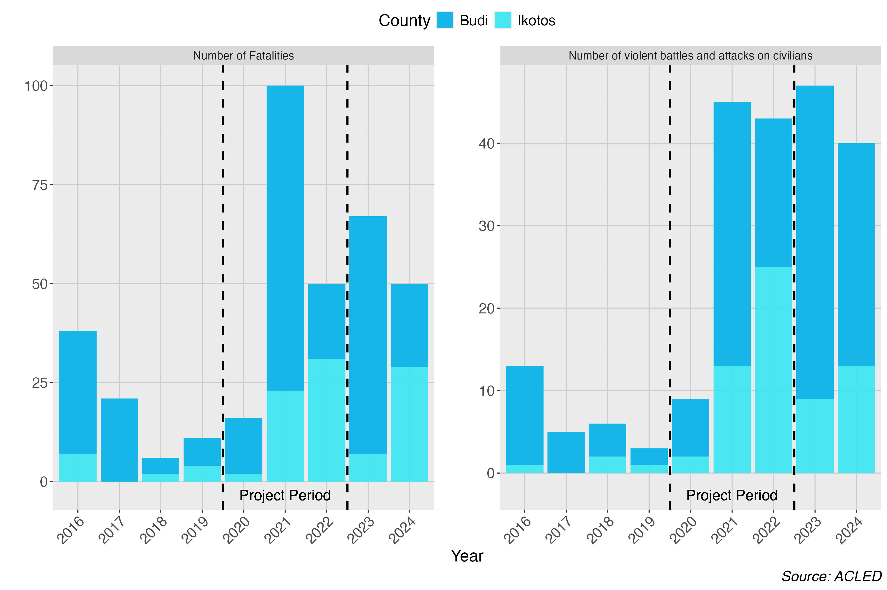
</div>

# Text data for uncovering specific types of violence {#sec-semantic}

Another important data source when investigating peacebuilding interventions is text data, which is also possible using ACLED, as the data source contains a short description of the recorded event, allowing us to investigate specific flavours of violent events. This is an approach relevant for the Budi evaluation, since its theory of change focused on reducing cattle raiding and tensions between ethnic groups. In order not to manually go through all the recorded cases of violence to investigate whether they relate to the aforementioned topics, I will use natural language processing (NLP). It is important to mention that this specific source of text data is descriptive, and therefore I will apply tools that capture attributes or nuances related to a violent event; however, if the text data instead came from a more normative source, where each data point relates to a normative statement about, for instance, an ethnic group or political opponent, which would be the case for social media posts or political speeches, we could use NLP combined with machine learning models or large language model methods to investigate whether levels of hate speech had changed after the end of the project. I will link to articles on the aforementioned matter at the end of the post, but here I will showcase examples relating to the concrete evaluation. 

In this NLP analysis I will utilise the classical topic modelling approach called Latent Dirichlet Allocation (LDA) [@944919.944937], which relies on the bag-of-words text data structure. An approach that discards the order in which words occur in a sentence, in favor of how many times a word occurred in a text. As a text contains nonesensical characters for topic modelling and repetitive words not conveing any substantial information about a text's topic, I will apply a set of cleaning and standardisation steps of the text. A process named pre-processing, which typically involves lower-casing, removing punctuation, numbers, URLs and stopwords, and reducing words to their root form (lemmatization or stemming). Yet, according to @dennyTextPreprocessingUnsupervised2018, the collection of preprocesseing steps you choose, can deeply affect both the search for the optimal number of topics in a topic model, and furthermore the words related to a given topic in a topic model. Therefore, it is important to justify the choices, and conduct a sensitivity analysis of how each choice impacts the final results. An example of this analysis is shown in the figures below: 

```{=html}
<details>
<summary>Code for preText analysis</summary>
```
```{r}
#| label: preText analysis of pre-preocessing choice
#| eval: false
#| warning: false
library(preText)
library(quanteda)
library(reticulate)

# Using the lemmatized version of factorial_preprocessing

source(file = "path/to/Lem_pre_text_spacyr_new.R")

################################
##### Using Pretext package to understand how different text preprocessing 
##### decisions affect the analysis
################################

# Loading data 
text <- focus_df$notes

# Removing white spaces and other html tags
text <- str_squish(text)
text_corpus <- stringi::stri_enc_toutf8(text)

# Choosing python environment where spacy is installed
use_python("/opt/homebrew/Caskroom/miniconda/base/bin/python", required = TRUE) 

# Now calcualting the effect of of the different combinations
preprocessed_documents <- factorial_preprocessing_lem(text = text_corpus,
                                                      use_ngrams = FALSE,
                                                      infrequent_term_threshold = 0.02,
                                                      intermediate_directory = "path/to/data", 
                                                      python_script = "path/to/lem.py") 

## Calculate preText scores 
preText_results <- preText_lem(
  preprocessed_documents,
  dataset_name = "ACLED notes",
  distance_method = "cosine",
  num_comparisons = 10,
  verbose = T)

##### Understand how different preproccesing steps will affect the DTM
## Graphing each preprocesseing specification
preText_plot <- preText_score_plot(preText_results)

## Graphing the conditional effects of each preprocessing step on the mean preText score for each specification that included that step
regpreText_plot <- regression_coefficient_plot(preText_results,
                            remove_intercept = TRUE)

```

</details>


Figure 2 depicts the effect of pre-processing specifications, beginning from the least risky ones on top, which are the ones with the lowest preText score. Narrowing down on each pre-processing specification, figure 3 shows the conditional effects of each preprocessing step on the mean preText score for each specification that included that step. Here again, a negative coefficient indicates that a step tends to reduce the unusualness of the results, while a positive coefficient indicates that applying the step is likely to produce more unusual results when creating the final corpus. The analysis shows that only the removal of stopwords will create a more unusual corpus, whereas the removal of punctuation will have a positive effect. 

<div style="text-align: left;">
  <div style="font-weight: bold;">Figure 2 - preText scores for each combination</div>
  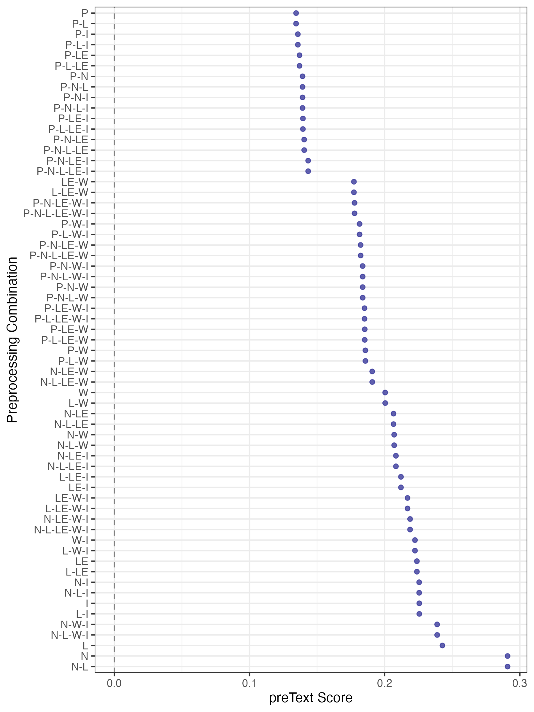
</div>

<div style="text-align: left;">
  <div style="font-weight: bold;">Figure 3 - Conditional mean preText scores for pre-processing step</div>
  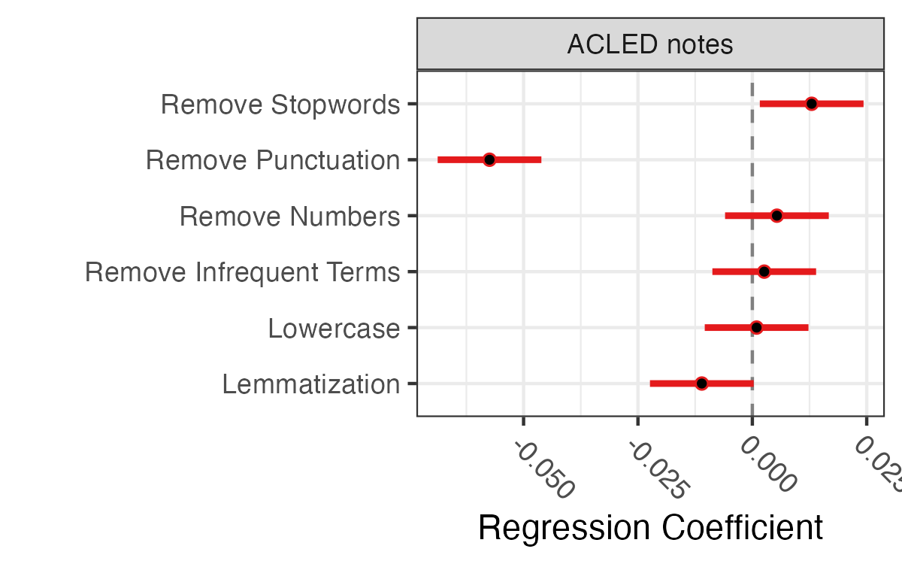
</div>


For modern NLP methods like embedding- and transformer-based models, that are trained on raw text and derive meaning from context, the same amount of preprocessing is unnecessary or even counter-productive. In a future blog post I will apply this technique, but as I have not witnessed major improvements in the topic discovery when applying these methods and as the transformed-based models require more computing power, I will use LDA here. In the code cells below I apply the selected pre-processesing specifications and build the final corpus.


```{=html}
<details>
<summary>Code: clean ACLED event text (R)</summary>
```
```{r}
#| label: acled-text-clean
#| eval: false
# Cleaning text
acled_text <- focus_df |> 
  select(notes, year, event_type, sub_event_type, actor1, actor2) |> 
  # Keep only rows with non-missing, non-empty notes
  filter(!is.na(notes), str_trim(notes) != "") |> 
  mutate(
    doc_id = row_number(),
    # Lowercase
    notes = str_to_lower(notes),

    # Remove URLs
    notes = str_remove_all(notes, "https?://\\S+|www\\.\\S+"),

    # Remove email addresses
    notes = str_remove_all(notes, "\\S+@\\S+\\.\\S+"),

    # Remove numbers (standalone digits; keep alphanumeric if needed)
    notes = str_remove_all(notes, "\\b\\d+\\b"),

    # Remove punctuation (keep hyphens between words)
    notes = str_replace_all(notes, "[^a-z\\s\\-]", " "),

    # Collapse multiple spaces
    notes = str_squish(notes)
  )

write_csv(acled_text, file = "projects/29-03-2026-South-Sudan-Violence/data/acled_textR.csv")
```

</details>

```{=html}
<details>
<summary>Code: lemmatise text with spaCy (Python)</summary>
```
```{python}
#| label: acled-lemmatize
#| eval: false
#| python.reticulate: false
# Loading libaries
import pandas as pd
import spacy
import re
from spacy.lang.en.stop_words import STOP_WORDS

# Loading spacy language model 
nlp_lem = spacy.load("en_core_web_sm", disable=["parser", "ner"])

# Loading data
acled_text = pd.read_csv("projects/29-03-2026-South-Sudan-Violence/data/acled_textR.csv")

# Performing lemmatization
lem_list =[]
for text in acled_text["notes"]:
  doc = nlp_lem(text)
  tokens = [token.lemma_ for token in doc if not token.is_stop and not token.is_punct and not token.is_space and token.lemma_.strip() != ""]
  new_text =  " ".join(tokens)
  lem_list.append(new_text)


# Adding list to original data frame 
acled_text["lem_notes"] = lem_list

# Saving df as csv
acled_text.to_csv("projects/29-03-2026-South-Sudan-Violence/data/acled_textLEM.csv", index=False)
```

</details>


```{=html}
<details>
<summary>Code: build the document-term matrix</summary>
```
```{r}
#| label: build-dtm
#| eval: false
# Loading the new lemmatized text
acled_text <- read_csv("projects/29-03-2026-South-Sudan-Violence/data/acled_textLEM.csv")

# Looking at the preprocessing of the text
summary(map_int(acled_text$lem_notes, \(x) nchar(x))) # Density of characters in the lemmatized text

# Create a corpus from the lemmatized text
corp <- corpus(acled_text$lem_notes)

# Tokenize, then build a document-feature matrix (quanteda's term "dfm" == "dtm")
# min_nchar = 2 reproduces your wordLengths = c(2, Inf)
toks <- tokens(corp)
dfm_raw <- dfm(toks) |>
  dfm_keep(min_nchar = 2)

# Term document frequencies (docfreq = number of docs each term appears in)
term_doc_freq <- docfreq(dfm_raw)          # count of docs per term
term_doc_prop <- term_doc_freq / ndoc(dfm_raw)

# See the distribution
summary(term_doc_freq)
quantile(term_doc_prop, probs = c(0.01, 0.05, 0.10, 0.50, 0.90, 0.95, 0.99))

# Inspect what I will lose at different thresholds
sort(term_doc_freq[term_doc_freq <= 5])    # what does MIN = 5 remove?
sort(term_doc_prop[term_doc_prop >= 0.80], decreasing = TRUE)  # what does MAX = 0.80 remove?

# Based on the above analysis I will settle on the following thresholds
MIN_DOC_FREQ <- 1     # keep all terms
MAX_DOC_FREQ <- 0.80

rm(dfm_raw)

# Creating the final document-feature matrix with both bounds in one step.
# dfm_trim applies doc-frequency floors/ceilings directly:
#   min_docfreq with a count, max_docfreq with a proportion.
dfm_final <- dfm(toks) |>
  dfm_keep(min_nchar = 2) |>
  dfm_trim(
    min_docfreq = MIN_DOC_FREQ,           # absolute count (>= 1 doc)
    max_docfreq = MAX_DOC_FREQ,           # proportion (<= 80% of docs)
    docfreq_type = "prop"                 # interpret max_docfreq as a proportion
  )

# Converting the dtm to a topic model object
dtm <- convert(dfm_final, to = "topicmodels")
```

</details>

Besides the preprocessing steps, LDA requires you to make a series of analytical choices. The most important one is to a priori specify the number of topics that the corpus of texts and the individual texts can contain. In the code below I test the effect of each choice and compare them using relevant metrics, and assess the results manually. The best result is achieved using five topics, and importantly topic 3 is assessed to reflect cattle raiding (see figure 4).

```{=html}
<details>
<summary>Code for Figure 4: Tune and fit the LDA topic model</summary>
```
```{r}
#| label: lda-topic-model
#| eval: false
# =============================================================================
# Tune and create final model 
# =============================================================================
### Firstly I will tune the model to find the optimal number of topics

candidate_k <- seq(2, 8, by = 1)

lda_metrics <- map_dfr(candidate_k, function(k) {
  lda_temp <- LDA(dtm, k = k, method = "Gibbs",
                  control = list(seed = 42, iter = 1000))
  
  scores <- topic_coherence(lda_temp, dtm, top_n_tokens = 10)
  
  tibble(
    k              = k,
    perplexity     = perplexity(lda_temp, newdata = dtm),
    mean_coherence = mean(scores),
    min_coherence  = min(scores),
    sd_coherence   = sd(scores)
  )
})

# Pivot to long format for facet_wrap
lda_metrics_long <- lda_metrics |>
  select(k, perplexity, mean_coherence) |>
  pivot_longer(cols = c(perplexity, mean_coherence),
               names_to = "metric", values_to = "value") |>
  mutate(metric = recode(metric,
    "perplexity"     = "Perplexity (lower = better fit)",
    "mean_coherence" = "Coherence (higher = more interpretable)"
  ))

ggplot(lda_metrics_long, aes(k, value)) +
  geom_line() +
  geom_point() +
  facet_wrap(~ metric, scales = "free_y", ncol = 1) +
  scale_x_continuous(breaks = candidate_k) +
  labs(title = "LDA Model Selection: Perplexity vs Coherence",
       x = "Number of Topics (k)", y = NULL) +
  theme_minimal()

# Set BEST_K based on my diagnostics above
BEST_K <- 5
 
lda_model <- LDA(
  dtm,
  k       = BEST_K,
  method  = "Gibbs",
  control = list(
    seed    = 42,
    iter    = 4000,       # more iterations for better convergence
    burnin  = 1000,       # proportionally longer burn-in
    thin    = 100,
    alpha   = 1 / BEST_K, # low alpha: documents concentrate on fewer topics
    delta   = 0.01         # low delta: topics concentrate on fewer words
  )
)

### Loading model 
#lda_model <- readRDS("projects/29-03-2026-South-Sudan-Violence/lda_model.rds")

# =============================================================================
# Inspect topics
# =============================================================================

# Top terms per topic (beta matrix)
topic_terms <- tidy(lda_model, matrix = "beta") |>
  group_by(topic) |>
  slice_max(beta, n = 15) |>
  ungroup() |>
  arrange(topic, -beta)
 
# Print top 15 terms per topic
topic_terms |>
  group_by(topic) |>
  summarise(top_terms = paste(term, collapse = ", ")) |>
  print(n = Inf)
 
# Visualise top terms per topic
lda_top_terms <- topic_terms |>
  mutate(term = reorder_within(term, beta, topic)) |>
  ggplot(aes(beta, term, fill = factor(topic))) +
  geom_col(show.legend = FALSE) +
  scale_fill_brewer(palette = "Dark2") +
  facet_wrap(~ topic, scales = "free_y", ncol = 3) +
  scale_y_reordered() +
  labs(title = "Top 15 Terms per LDA Topic",
       x = "Term probability (beta)", y = NULL) +
  theme_minimal(base_size = 11)

ggsave("projects/29-03-2026-South-Sudan-Violence/figures/figure_3_lda_top_terms.png", lda_top_terms, width = 14, height = 10)

### Saving the model 
#saveRDS(lda_model, "projects/29-03-2026-South-Sudan-Violence/lda_model.rds")
```

</details>

<div style="text-align: left;">
  <div style="font-weight: bold;">Figure 4 - Top terms per LDA topic</div>
  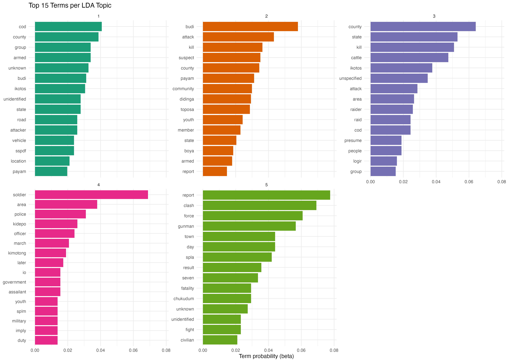
</div>

Having settled on the final topic model containing five topics, I will now apply it to the full dataset and calculate the composition of topics for each year. As described in the previous section, I will focus on topic 3. Figure 5 below shows that at the end of the project's period topic 3 peaked, indicating that cattle raiding became more prevalent; however, we see a decrease in the years after. Instead of using topics as an indicator for cattle raiding, in figure 6 I use specific word mentions related to cattle raiding — the mention of specific words or combinations of them: ((cattle OR cow OR herd OR livestock) AND raid) OR (cattle OR cow OR herd OR livestock). A similar, yet not identical, picture emerges: there is also an increase in cattle raiding across the project period, but not the sharp decrease indicated by the topic model. 


```{=html}
<details>
<summary>Code for Figure 5: topic composition by year</summary>
```
```{r}
#| label: topic-by-year-plot
#| eval: false


# =============================================================================
# Tmeporal analysis of topic distribution
# =============================================================================

# Assign each event to its most probable topic
dominant_topic <- tidy(lda_model, matrix = "gamma") |>
  mutate(document = as.integer(document)) |>
  group_by(document) |>
  slice_max(gamma, n = 1) |>
  ungroup()

# Join with ACLED data
 acled_topics <- acled_text |>
  left_join(dominant_topic, by = c("doc_id" = "document"))

# Count events per topic per year
topic_by_year <- acled_topics |>
  count(year, topic) |>
  group_by(year) |>
  mutate(pct = n / sum(n) * 100)

n_per_year <- acled_text |>
  count(year, name = "n_events")

# Plot
topic_year <- ggplot(topic_by_year, aes(year, pct, color = factor(topic), alpha = if_else(topic == 3, 1, 0.2))) +
  geom_line(size = 1.5) +  # Increase line thickness
  scale_y_continuous(labels = \(x) paste0(x, "%")) +
  scale_color_brewer(palette = "Dark2") +  
  scale_alpha_identity() +
  labs(title = "Thematic Composition of Violent Events by Year",
       x = "Year", y = "Share of Events (%)", color = "Topic") +
  geom_vline(xintercept = 2019, linetype = "dashed", color = "black", size = 1) +
  geom_vline(xintercept = 2022, linetype = "dashed", color = "black", size = 1) +
  geom_text(aes(x = 2020.5, y = -2, label = "Project Period"), vjust = 1, hjust = 0.5, size = 4, color = "black") +
  theme_minimal() 

ggsave("projects/29-03-2026-South-Sudan-Violence/figures/figure_4_topic_year.png", topic_year, width = 14, height = 10)
```

</details>

<div style="text-align: left;">
  <div style="font-weight: bold;">Figure 5 - Topic focus across years</div>
  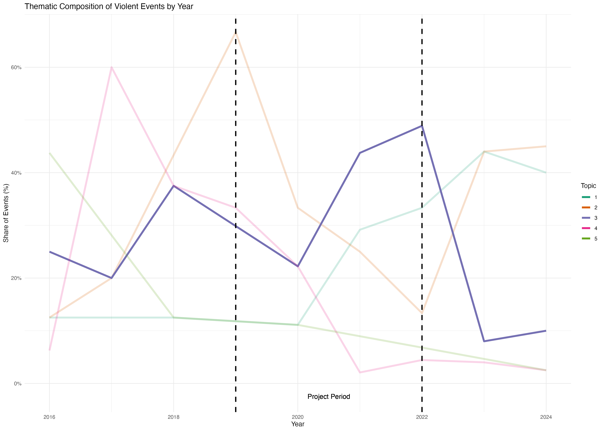
</div>

```{=html}
<details>
<summary>Code for Figure 6: cattle-raid keyword share by year</summary>
```
```{r}
#| label: cattle-raid-plot
#| eval: false
# NOTE: the detection below currently reduces to the keyword match alone, because
# `(A & B) | A` simplifies to `A`. If you intended raid-specific cattle mentions,
# drop the trailing OR clause; otherwise this matches any cattle/cow/herd/livestock note.
word_plot_year <- acled_text |> 
  group_by(year) |> 
  summarise(
    n_cattle_raid = sum((str_detect(lem_notes, "cattle|cow|herd|livestock") & str_detect(lem_notes, "raid")) | str_detect(lem_notes, "cattle|cow|herd|livestock")),
    n_events      = n(),
    pct           = n_cattle_raid / n_events * 100) |> 
  ggplot(aes(x = year, y = pct)) +
  geom_vline(xintercept = 2019, linetype = "dashed", color = "black", size = 1) +
  geom_vline(xintercept = 2022, linetype = "dashed", color = "black", size = 1) +
  geom_text(aes(x = 2020.5, y = -2, label = "Project Period"), vjust = 1, hjust = 0.5, size = 4, color = "black") +
  geom_point(color = "#16b7e8ff", size = 3) +
  geom_line(color = "#16b7e8ff", size = 1) + 
  labs(title = "Cattle raid related events",
       x = "Year", y = "Share of Events (%)") +
  theme_minimal() 

ggsave("projects/29-03-2026-South-Sudan-Violence/figures/figure_5_word_year.png", word_plot_year, width = 14, height = 10)
```

</details>

<div style="text-align: left;">
  <div style="font-weight: bold;">Figure 6 - Share of cattle raiding events</div>
  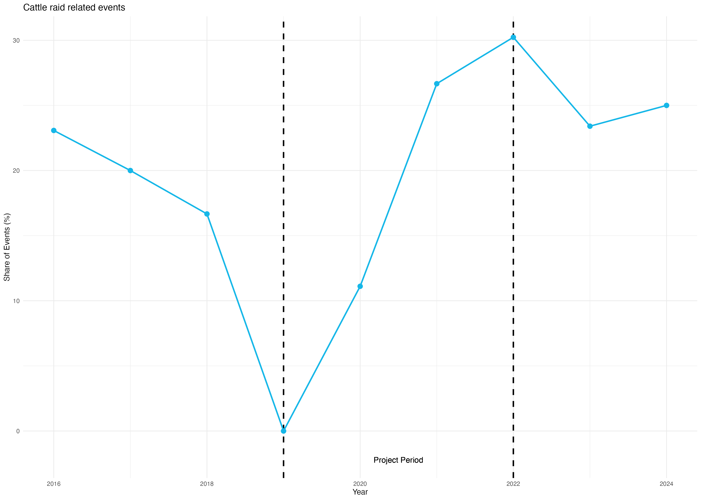
</div>


# Internally displaced people as a measure of indirect violence {#sec-internally-displaced}

Another measure of conflict intensity is to look at the number of internally displaced persons (IDPs) in the area investigated, as recorded by the International Organisation for Migration (IOM)'s Displacement Tracking Matrix. IOM collects data through enumerators who conduct key-informant interviews with persons on site. I use the `dtmapi` R package to connect to IOM's API, allowing me to fetch data for the two counties being investigated as part of the evaluation, and plot the number of IDPs over time and the reason for fleeing, as seen in figure 7. Similar to the number of violent events, we also see an increase in the number of IDPs in the two counties during the project period; yet, this decreases in the following years. When asked why IDPs have chosen to flee, the reason is, according to key informants' assessments, conflict. 


```{=html}
<details>
<summary>Code for Figure 7: IDP trends and displacement reasons</summary>
```
```{r}
#| label: idp-trends-plot
#| eval: false
#############
### IDPs
#############
library(lubridate)
library(scales)
library(stars)
library(sf)
library(dtmapi)
library(patchwork)
library(ggtext)   # for element_markdown() in the caption below

# Define custom colors for each admin2
custom_colors <- c(
  "Budi" = "#16b7e8ff",   # Budi (teal)
  "Ikotos" = "#33e7f4df"  # Ikotos (light teal)
)

# Get data 
idp_SS_df <- get_idp_admin2_data(CountryName='South Sudan', FromReportingDate='2016-01-01', ToReportingDate='2024-12-02')

# Filter data 
idp_SS_df <- idp_SS_df |> 
  filter(assessmentType == "BA") |> 
  filter(admin2Name %in% c("Budi", "Ikotos")) 

# Counting the number of IDPs in each county per year (most recent round per year)
# NOTE: dropped a trailing knitr::kable() here so the result stays a data frame
# that can be passed to ggplot() below.
idp_sum_df <- idp_SS_df |> 
  group_by(yearReportingDate, admin2Name, displacementReason) |> 
  slice_max(roundNumber, n = 1, with_ties = FALSE) |> 
  group_by(yearReportingDate, admin2Name) |> 
  summarise(numPresentIdpInd = sum(numPresentIdpInd, na.rm = TRUE), .groups = "drop")

# Plot: IDP totals per county per year
idps_plot <- ggplot(idp_sum_df,
       aes(x = yearReportingDate, 
           y = numPresentIdpInd, 
           group = admin2Name, 
           color = admin2Name)) + 
  geom_line(linewidth = 1) +
  geom_point(size = 3) +
  scale_y_continuous(labels = comma, 
                     breaks = seq(0, max(idp_sum_df$numPresentIdpInd), by = 2500)) +
  scale_x_continuous(breaks = unique(idp_sum_df$yearReportingDate), labels = unique(idp_sum_df$yearReportingDate)) + 
  scale_color_manual(values = custom_colors) +
  labs(x = "",
       y = "Number of IDPs",
       color = "County",
       caption = "") +
  theme_minimal() +
  theme(
    plot.title = element_text(face = "bold", size = 14),
    plot.subtitle = element_text(size = 12),
    axis.text.x = element_text(angle = 45, hjust = 1),
    panel.grid.major = element_line(color = "grey80", linetype = "solid"),
    panel.grid.minor = element_line(color = "grey90", linetype = "dotted"),
    legend.position = "top", 
    legend.text = element_text(size = 12), 
    legend.title = element_text(size = 14),
    plot.caption = element_text(size = 9, face = "italic")
  ) + 
  annotate("rect",
    xmin = 2019, xmax = 2022,
    ymin = -Inf, ymax = Inf,
    alpha = 0.15, fill = "steelblue")


# Aggregate by year 
reason_year_df <- idp_SS_df |>
  group_by(yearReportingDate, admin2Name, displacementReason) |>
  slice_max(roundNumber, n = 1, with_ties = FALSE) |>
  ungroup() |>
  group_by(yearReportingDate, displacementReason) |>
  summarise(numPresentIdpInd = sum(numPresentIdpInd), .groups = "drop") |>
  mutate(displacementReason = case_when(
    str_detect(displacementReason, "No reason") ~ "Unknown / Not recorded",
    TRUE ~ displacementReason
  )) |>
  # Calculate percentage within each year
  group_by(yearReportingDate) |>
  mutate(
    total = sum(numPresentIdpInd),
    pct   = numPresentIdpInd / total * 100
  ) |>
  ungroup()

## Creating response plot
reason_plot <- ggplot(reason_year_df,
       aes(x = yearReportingDate,
           y = pct,
           fill = displacementReason)) +

  annotate("rect",
           xmin = 2019, xmax = 2022,
           ymin = -Inf, ymax = Inf,
           alpha = 0.15, fill = "steelblue") +

  geom_col(position = "stack", width = 0.7, alpha = 0.9) +

  # Optional: add percentage labels inside the bars (only if segment is big enough)
  geom_text(aes(label = ifelse(pct > 8, paste0(round(pct, 0), "%"), "")),
            position = position_stack(vjust = 0.5),
            size = 3.2, color = "white", fontface = "bold") +

  scale_y_continuous(labels = function(x) paste0(x, "%"),
                     breaks = seq(0, 100, by = 25),
                     limits = c(0, 100),
                     expand = expansion(mult = c(0.02, 0.03))) +
  scale_x_continuous(breaks = unique(reason_year_df$yearReportingDate),
                     expand = expansion(mult = 0.05)) +
  scale_fill_brewer(palette = "Set2") +

  labs(x    = NULL,
       y    = "Share of IDPs (%)",
       fill = "Displacement reason") +

  theme_minimal(base_size = 13) +
  theme(
    axis.text.x        = element_text(angle = 45, hjust = 1, color = "grey30"),
    axis.text.y        = element_text(color = "grey30"),
    axis.title.y       = element_text(margin = margin(r = 10), color = "grey20"),
    panel.grid.major.x = element_blank(),
    panel.grid.major.y = element_line(color = "grey88"),
    panel.grid.minor   = element_blank(),
    legend.position    = "bottom",
    legend.text        = element_text(size = 10),
    legend.title       = element_text(size = 11),
    plot.margin        = margin(10, 15, 10, 10)
  ) +
  guides(fill = guide_legend(nrow = 2))

# Combing plots
combined_plot <- idps_plot / reason_plot +
  plot_layout(heights = c(2, 1)) +   # give line plot slightly more space
  plot_annotation(
    title    = "",
    subtitle = "",
    caption  = "*Source: IOM Displacement Tracking Matrix*",
    theme = theme(
      plot.title    = element_text(face = "bold", size = 15),
      plot.subtitle = element_text(size = 12, color = "grey30"),
      plot.caption  = element_markdown(size = 9, color = "grey50", hjust = 0)
    )
  )

```

</details>


<div style="text-align: left;">
  <div style="font-weight: bold;">Figure 7 - IDPs in Budi and Ikotos counties by year</div>
  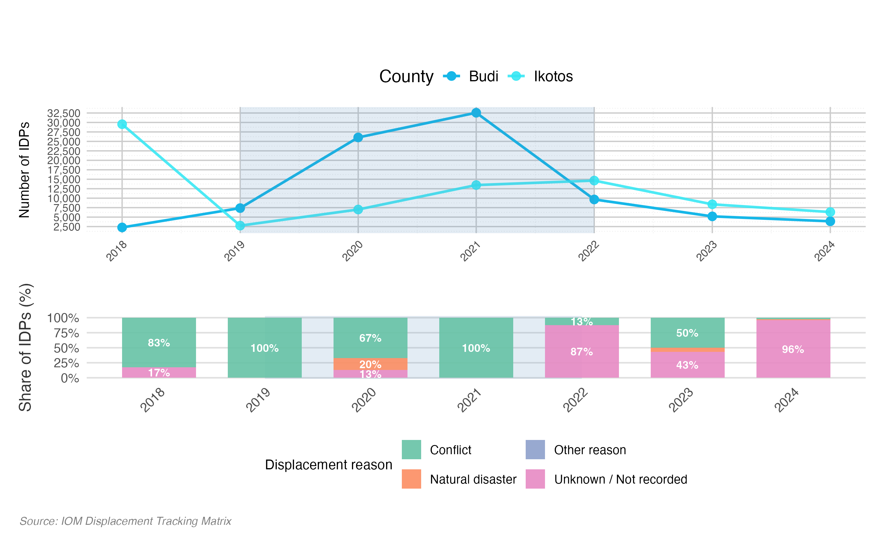
</div>


# Alternative explanations {#sec-alt-exp}

Rounding up the Budi example, the overall signal from above quantitative measures indicates that violence increased during implementation of the project; however, it decreased after project closure, though not to the same level as before the project was initiated. This indicates that another conflict driver has been operating. The qualitative evidence points to increased levels of violence after the signing of the R-ARCSS peace agreement in 2018 [@BudiConflictSensitivity2020]. Another important driver worth considering is climate change, which I will briefly explore using the Standardised Precipitation-Evapotranspiration Index (SPEI), allowing the TBE to include other explanations of whether climatic conditions over the implementation period coincide with the observed rise in violence. The SPEI index is derived using precipitation and potential evapotranspiration to determine drought at a spatial resolution of 0.5 degrees (3,071.756 $km^2$ in South Sudan). The index ranges from -2 to 2, where 2 corresponds to an extremely wet situation and -2 to an extremely dry one, calculated with respect to the normal condition. From figure 8 it becomes clear that Budi and Ikotos have experienced sustained and more severe drought, as indicated by both the decrease in median SPEI and the decrease in variation in the measure. 

```{=html}
<details>
<summary>Code: SPEI grid-cell area calculation</summary>
```
```{r}
#| label: spei-cell-area
#| eval: false
# Approximate area (km^2) of a 0.5-degree SPEI grid cell at ~4.26 deg latitude
(0.5 * 111) * (0.5 * 111 * cos(4.25611 * pi / 180))
```

</details>

```{=html}
<details>
<summary>Code for Figure 8: SPEI drought boxplot</summary>
```
```{r}
#| label: spei-boxplot
#| eval: false

library(exactextractr)
library(raster)
library(stars)

# Read administrative data for South Sudan
path_adm2 <- paste0(getwd(),"/ssd_admbnda_imwg_nbs_20230829_SHP/ssd_admbnda_adm2_imwg_nbs_20230829.shp")
admin2_shp <- st_read(path_adm2)
admin2_shp <- admin2_shp |> 
  filter(ADM2_EN %in% c("Budi", "Ikotos"))

# Read drought data 
SPEI <- read_stars("spei06.nc")
SPEI <- st_set_crs(SPEI, 4326)

# Ensure consistent CRS
admin2_shp <- st_transform(admin2_shp, st_crs(SPEI))

# Convert time to POSIXct
time_values <- st_get_dimension_values(SPEI, "time")
SPEI <- st_set_dimensions(SPEI, "time", values = as.POSIXct(time_values, tz = "UTC"))

# Subset SPEI data to the desired time frame (2016-2024)
start_date <- as.POSIXct("2016-01-01", tz = "UTC")
end_date <- as.POSIXct("2024-12-31", tz = "UTC")
SPEI_subset <- SPEI %>%
  slice("time", which(time_values >= start_date & time_values <= end_date))

# Get the bounding box of the administrative shapefile
bbox <- st_bbox(admin2_shp)

# Crop the SPEI raster using the bounding box
SPEI_cropped <- st_crop(SPEI_subset, bbox)

# Exploratory
ggplot() +
  geom_stars(data = SPEI_final, aes(fill = spei06.nc)) +
  geom_sf(data = admin2_shp, fill = NA, color = "black", size = 0.5) +
  scale_fill_viridis_c(name = "SPEI") +
  labs(
    title = "SPEI and Administrative Boundaries",
    subtitle = "Cropped to Admin2 Region",
    x = "Longitude",
    y = "Latitude"
  ) +
  facet_wrap(~time, ncol = 12) +  # This will create a grid of plots, one for each time step
  theme_minimal()


## Looking a difference over time  
SPEI_raster <- as(SPEI_cropped, "Raster")

# Subset time values
time_subset <- time_values[which(time_values >= start_date & time_values <= end_date)]

# Calculate mean SPEI for each polygon at each time point
spei_zonal_stats_long <- lapply(seq_along(time_subset), function(i) {
  data.frame(
    ADM2_EN = admin2_shp$ADM2_EN,
    time = time_subset[i],
    mean_spei = exact_extract(SPEI_raster[[i]], admin2_shp, 'mean')
  )
}) %>% 
  do.call(rbind, .)

# Plot time series
# Extract year from the time column
spei_zonal_stats_long <- spei_zonal_stats_long |> 
  mutate(
    year = lubridate::year(time),
    month = lubridate::month(time)
  )

drought_graph <- ggplot(spei_zonal_stats_long, 
                        aes(x = as.factor(year), 
                            y = mean_spei, 
                            fill = ADM2_EN)) + 
  geom_boxplot() +
  scale_fill_manual(values = custom_colors)+
  labs(
    x = "Year", 
    y = "Mean SPEI", 
    fill = "County",
    caption = "Source: SPEI Drought Database"
  ) +
  theme_minimal() +
  theme(
    axis.title.x = element_text(size = 24),  # Increased from 20
    axis.title.y = element_text(size = 24),  # Increased from 20
    axis.text.x = element_text(angle = 45, hjust = 1, size = 20),  # Increased from 14
    axis.text.y = element_text(size = 22),  # Increased from 18
    legend.text = element_text(size = 24),  # Increased from 20
    strip.text = element_text(size = 18),  # Increased from 14
    legend.title = element_text(size = 24),  # Increased from 20
    panel.grid.major = element_line(color = "grey80", linetype = "solid"),
    panel.grid.minor = element_line(color = "grey90", linetype = "dotted"),
    legend.position = "top",
    plot.caption = element_text(size = 18, face = "italic"),  # Increased from 16
    panel.spacing = unit(3, "lines"), 
    legend.key.size = unit(2, "cm"),      # Add this line to increase legend symbol size
    legend.key.width = unit(2, "cm")    
  )
```

</details>

<div style="text-align: left;">
  <div style="font-weight: bold;">Figure 8 - SPEI drought index in Budi and Ikotos counties by year</div>
  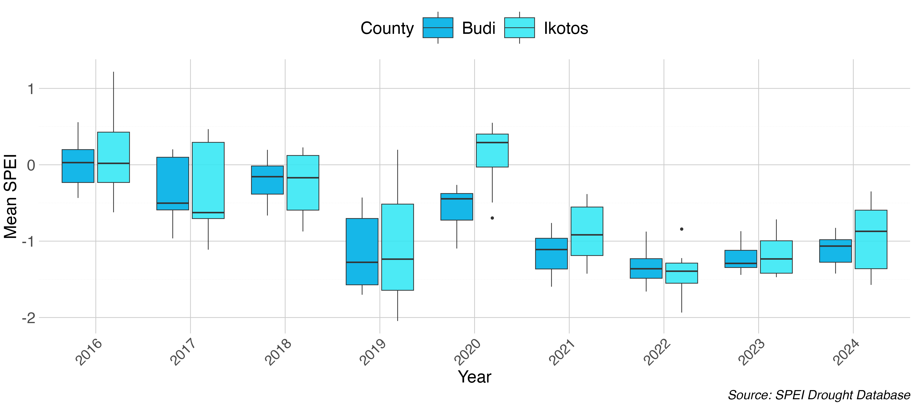
</div>

# Spatial location of violent events and peacebuilding projects {#sec-spat-vio}

As the Budi project focused on just two counties, the measurements covered so far have had a deliberately narrow geographical focus. The independent evaluation of SDC's peacebuilding engagement, by contrast, was concerned with country-wide impact across SDC's entire portfolio. This shift in scope calls for more aggregate measurements while still attending to local spatial variation — a balance I illustrate here using data from a Mozambique case study.

Drawing on project reports and open sources, I first geocoded the location of SDC-supported peacebuilding interventions to the lowest available administrative unit (the municipality, or ADM2), and mapped these against the distribution of violent events recorded by ACLED. Because ACLED records violence as geographic *points*, I have to choose how to aggregate them into an intensity surface. Aggregating to administrative boundaries is the obvious option, but municipalities vary widely in size and shape, which distorts apparent intensity. Meaning that a large, sparsely affected district and a small, heavily affected one are not comparable. Instead I bin the events onto a regular hexagonal grid with a cell size of 0.3° (an average $790 km^2$ per hexagon at this latitude). The code below reproduces this approach as seen in Figure 9, summed across the full evaluation period. Figure 10 applies the same grid to separate sub-periods, allowing us to trace how patterns of violence shifted both temporally and spatially.

Two things stand out from Figures 9 and 10. First, violence in Mozambique is highly concentrated: most of the country sits in the lowest intensity band, with a single intense cluster in the far north-east (Cabo Delgado). As seen in Figure 10 this reflects a recent surge in insurgency and government violence. A pattern that the supported Maputo peace process did not adress, due to its focus on the historical FRELIMO–RENAMO confrontation, concentrated in the centre and south. Second, and following from this, it can be seen that the sampled peacebuilding projects largely track this *older* conflict geography rather than the current "live" one, as they cluster in the now lower-intensity centre, with much thinner coverage in the acutely violent north-east.

As before, the caveat is that at this scale the overlay is descriptive; it only shows *where* projects sit relative to violence, not whether they moved it. Pursuing the causal question would require finer-grained data on project location and timing; with that, one could follow @schutteMatchedWakeAnalysis2014 and apply matched wake analysis to estimate the effect of peacebuilding presence on subsequent violence.


```{=html}
<details>
<summary>Code for Figure 9: Mozambique conflict map and projects</summary>
```
```{r}
#| label: mozambique-conflict-map
#| eval: false
### Prerequisites
library(tidyverse)
library(sf)
library(ggrepel)
library(rgeoboundaries)
library(RColorBrewer)
library(classInt)     # for classIntervals() (Jenks breaks)
library(ggnewscale)   # for new_scale_colour() (two colour scales on one map)
library(units)

# Loading administrative base maps
mozambique_ADM1_sf <- geoboundaries("Mozambique", "adm1")
mozambique_ADM2_sf <- geoboundaries("Mozambique", "adm2")
mozambique_ADM0_sf <- geoboundaries("Mozambique", "adm0")

# Loading capital and administrative cities in Mozambique
moz_cities <- read_csv("data/map/mozambique_cities.csv") |> 
  filter(capital %in% c("primary", "admin")) |>
  st_as_sf(coords = c("lng", "lat"), crs = st_crs(mozambique_ADM2_sf))

## Reading ACLED data
path_acled <- "your path to ACLED"

ACLED_df <- read_csv(path_acled) |> 
  filter(country == "Mozambique") |> 
  filter(!(sub_event_type %in% c("Government regains territory", 
                                 "Non-state actor overtakes territory", 
                                 "Government overtakes territory", 
                                 "Non-state actor overtakes territory", 
                                 "Sexual violence", 
                                 "Government regains territory", 
                                 "Abduction/forced disappearance")))

# Converting to a spatial object
ACLED_sf <- st_as_sf(ACLED_df, 
  coords = c("longitude", "latitude"), 
  crs = st_crs(mozambique_ADM0_sf))

# Create union of all Mozambique boundaries
mozambique_boundary <- st_union(mozambique_ADM0_sf)

# Create hexagonal grid over Mozambique
hex_grid <- st_make_grid(
  mozambique_boundary,
  cellsize = 0.3,
  square = FALSE,
  what = "polygons"
) |>
  st_sf() |>
  mutate(hex_id = row_number())

# Clip hexagons to Mozambique boundary
hex_grid_clipped <- st_intersection(hex_grid, mozambique_boundary)

library(units)

# Per-hexagon area (geodesic, on the ellipsoid — sf uses s2 for lon/lat data)
hex_grid_area <- hex_grid_clipped |>
  mutate(
    area_m2  = as.numeric(st_area(hex_grid_clipped)),
    area_km2 = area_m2 / 1e6
  )

# Summary
hex_grid_area |>
  st_drop_geometry() |>
  summarise(
    mean_km2   = mean(area_km2),
    median_km2 = median(area_km2),
    min_km2    = min(area_km2),
    max_km2    = max(area_km2),
    n_hex      = dplyr::n()
  )

#######
### Categorize conflicts 
#######

## Creating year intervals and counts of conflicts per hexagon

acled_per_hex_v2 <- hex_grid |>
  st_join(ACLED_sf) |>
  st_drop_geometry() |>
  filter(!is.na(year)) |>
  # Create year groups
  mutate(
    year_group = case_when(
      year <= 2017 ~ "2014-2017",
      year <= 2021 ~ "2018-2021",
      year <= 2024 ~ "2022-2024",
    ),
    year_group = factor(year_group, 
                        levels = c("2014-2017", "2018-2021", "2022-2024"))
  ) |>
  # Count by hex and year_group (aggregates across years within group)
  count(hex_id, year_group, name = "n_conflicts") |>
  complete(
    hex_id = unique(hex_grid$hex_id),
    year_group = factor(c("2014-2017", "2018-2021", "2022-2024"),
                        levels = c("2014-2017", "2018-2021", "2022-2024")),
    fill = list(n_conflicts = 0)
  )

# Join counts back to hex grid
hex_counts_year <- hex_grid_clipped |>
  left_join(acled_per_hex_v2, by = "hex_id")

## Categorize conflicts
# Compute Jenks (natural-breaks) class intervals on the conflict counts and print
# them. The printed break points are what the hard-coded category bounds below
# (1 / 4 / 18 / 39) are rounded from — inspect `breaks` and adjust the case_when()
# thresholds if you re-run on different data.
breaks <- classIntervals(hex_counts_year$n_conflicts, n = 5, style = "jenks")
print(breaks)

# Apply breaks
hex_counts_year <- hex_counts_year |>
  mutate(
    # Conflict categories read off the Jenks breaks above
    conflict_category = case_when(
      n_conflicts < 2 ~ "Very Low (0-1)",
      n_conflicts <= 4 ~ "Low (2-4)",
      n_conflicts <= 18 ~ "Medium (5-18)",
      n_conflicts <= 39 ~ "High (19-39)",
      TRUE ~ "Very High (39+)"
    ),
    conflict_category = factor(conflict_category, 
                               levels = c("Very Low (0-1)", "Low (2-4)", 
                                         "Medium (5-18)", "High (19-39)", 
                                         "Very High (39+)"))
  )

# Combining data (sum conflict counts per hexagon across all year groups)
hex_counts_total <- hex_counts_year |> 
  group_by(hex_id) |> 
  summarise(n_conflicts = sum(n_conflicts), .groups = "drop")

# Apply breaks
hex_counts_total <- hex_counts_total |>
  mutate(
    # Conflict categories read off the Jenks breaks above
    conflict_category = case_when(
      n_conflicts < 2 ~ "Very Low (0-1)",
      n_conflicts <= 4 ~ "Low (2-4)",
      n_conflicts <= 18 ~ "Medium (5-18)",
      n_conflicts <= 39 ~ "High (19-39)",
      TRUE ~ "Very High (39+)"
    ),
    conflict_category = factor(conflict_category, 
                               levels = c("Very Low (0-1)", "Low (2-4)", 
                                         "Medium (5-18)", "High (19-39)", 
                                         "Very High (39+)"))
  )

#########
###### Creating project locations data
#########

# MISSING IN SOURCE: replace this placeholder with the actual project-locations
# data frame. It must contain at least: name (ADM2 municipality), project_name,
# and peace ("Yes"/"No"). The map code below relies on these columns.
project_final_df_new <- "Data on locations of projects"

# Calculate centroids for municipalities
centroids_adm2 <- st_centroid(mozambique_ADM2_sf)
coords_adm2 <- st_coordinates(centroids_adm2)

# Get unique municipalities from your data
project_location_muni <- project_final_df_new |> 
  distinct()

# Create municipalities dataframe with coordinates
municipalities <- data.frame(
  municipality = unique(project_location_muni$name),
  lat = coords_adm2[match(unique(project_location_muni$name), 
                         mozambique_ADM2_sf$shapeName), 2],  # Adjust column name if needed
  lon = coords_adm2[match(unique(project_location_muni$name), 
                         mozambique_ADM2_sf$shapeName), 1]
)

# Join coordinates to project data
project_location_muni <- project_location_muni |> 
  left_join(municipalities, by = c("name" = "municipality"))


# Calculate offsets for multiple projects in same municipality
project_location_muni <- project_location_muni |> 
  group_by(name) |> 
  mutate(
    n_projects = n(),
    projects_index = row_number(),
    x_offset = (projects_index - (n_projects + 1)/2) * 0.15  # Smaller offset for denser map
  ) |> 
  ungroup()


# Separate the data
peace_data <- project_location_muni[project_location_muni$peace == "Yes",]
non_peace_data <- project_location_muni[project_location_muni$peace == "No",]

#########
###### Create reduced non-peace data (one per municipality)
#########
non_peace_data_reduced <- non_peace_data |>
  group_by(name) |>
  slice(1) |>
  ungroup()

#########
###### Set up separate palettes
#########
peace_projects <- unique(peace_data$project_name)
peace_palette <- brewer.pal(n = length(peace_projects), name = "Dark2")
names(peace_palette) <- peace_projects

non_projects <- unique(non_peace_data$project_name)  # Use full data for palette
non_peace_palette <- rep("gray50", length(non_projects))
names(non_peace_palette) <- non_projects

#########
###### Create the map
#########
map_adm2_vio <- ggplot() +

  # Hexagonal heatmap (clipped to Mozambique)
  geom_sf(data = hex_counts_total, 
          aes(fill = conflict_category),  # use conflict_category instead of n_conflicts ***
          color = NA, 
          alpha = 0.8) +
  scale_fill_brewer(  # ***  use scale_fill_brewer instead of scale_fill_distiller ***
    name = "Conflict Intensity\n(number of conflicts)",
    palette = "YlOrRd",  # *** Yellow-Orange-Red palette ***
    direction = 1
  ) +
  
  # ADM boundaries
  geom_sf(data = mozambique_ADM2_sf, fill = NA, color = "gray70", linewidth = 0.2) +
  geom_sf(data = mozambique_ADM1_sf, fill = NA, color = "gray50", linewidth = 0.8) +  
  
  # Non-peace projects (circles, gray) 
  geom_point(data = non_peace_data_reduced,
             aes(x = lon + x_offset, 
                 y = lat, 
                 colour = project_name),
             shape = 16,
             size = 4,  
             alpha = 0.5) + 
  # Use limits to include ALL non-peace projects in legend
  scale_colour_manual(values = non_peace_palette, 
                      name = "Other SDC Projects",
                      limits = non_projects) +
  guides(colour = guide_legend(order = 2, override.aes = list(shape = 16, size = 4))) +
  # Reset colour scale for second layer
  new_scale_colour() +

    # Peace-related projects (triangles, colored)
  geom_point(data = peace_data,
             aes(x = lon + x_offset, 
                 y = lat, 
                 colour = project_name),
             shape = 17,
             size = 4,  
             alpha = 0.9) + 
  scale_colour_manual(values = peace_palette, name = "Sampled Peacebuilding Projects") +
  guides(colour = guide_legend(order = 1, override.aes = list(shape = 17, size = 4))) +  

  # Major Cities
  geom_text_repel(data = moz_cities,
                  aes(label = city, geometry = geometry),
                  stat = "sf_coordinates",
                  size = 3,
                  fontface = "bold",
                  color = "black",
                  bg.color = "white",
                  bg.r = 0.15,
                  nudge_x = 1,  
                  box.padding = 0.3,
                  point.padding = 0.2,
                  segment.size = 1,
                  segment.color = "gray30",
                  min.segment.length = 0.1,
                  max.overlaps = Inf) +
  
  # Styling
  theme_void() +
  theme(
    legend.position = "right",
    legend.box = "vertical",
    panel.background = element_rect(fill = "white", color = NA),
    plot.background = element_rect(fill = "white", color = NA),
    plot.title = element_text(size = 14, face = "bold", hjust = 0, margin = margin(b = 5)),
    legend.title = element_text(size = 10, face = "bold"),
    legend.text = element_text(size = 9),
    legend.background = element_blank(),
    legend.margin = margin(t = 5, r = 5, b = 5, l = 5),
    plot.margin = margin(t = 10, r = 10, b = 10, l = 10)
  ) +
  coord_sf()
```

</details>

<div style="text-align: left;">
  <div style="font-weight: bold;">Figure 9 - SDC peacebuilding projects and ACLED conflict intensity in Mozambique</div>
  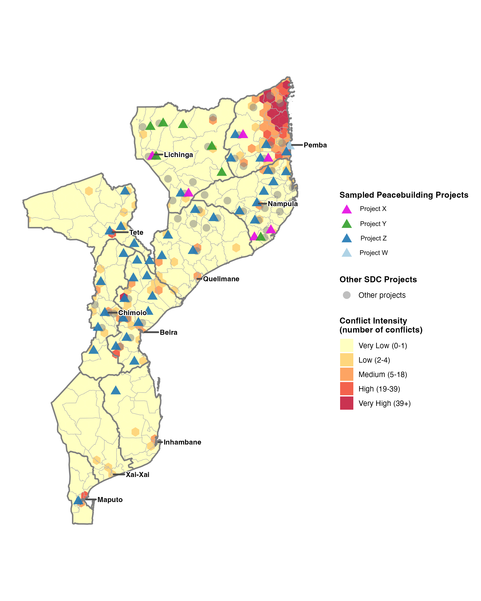
</div>

<div style="text-align: left;">
  <div style="font-weight: bold;">Figure 10 - ACLED conflict intensity in Mozambique across three periods</div>
  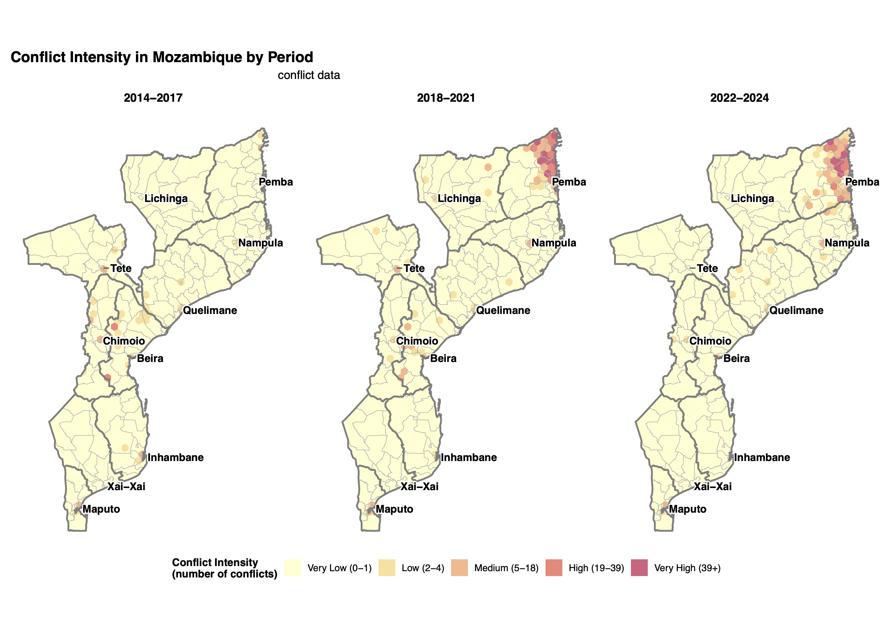
</div>

# Surveying people in conflict settings {#sec-survey}

A final source worth noting, though one I have not applied myself in these evaluations, is survey data. Rather than inferring violence from recorded events or satellite proxies, surveys go directly to the people involved, whether combatants, ex-combatants, or civilians, and ask them about their experiences, motivations, and circumstances. Humphreys and Weinstein's study of the civil war in Sierra Leone is a good example of such research use [@humphreysWhoFightsDeterminants2008]. Here the authors surveyed both former fighters and non-combatants to test competing explanations for why people join armed groups, spanning grievance, such as economic deprivation and political or ethnic marginalisation, selective incentives, such as payment or protection from violence, and social sanctions, such as whether one's community was already mobilised. Surveys are especially powerful for questions that leave no observable footprint in event or remote sensing data, such as individual motivation, perceptions of safety, trust in institutions, or attitudes toward other groups, which are often exactly the outcomes that peacebuilding interventions are trying to shift.

A good deal of survey data already exists and is freely available, so one does not always need to field a survey oneself. For the African continent the most useful of these for peacebuilding questions is Afrobarometer, a repeated, cross-national survey covering some forty African countries, which asks nationally representative samples about trust, safety, experiences of violence, ethnic and national identity, and confidence in institutions. Because it is repeated over successive rounds, it allows one to track how such attitudes shift over time, and, if granted permission, one can access a [georeferenced version of the survey data](https://www.afrobarometer.org/geocoded-data/), allowing the evaluation to measure attitudes more closely within a project's intervention area.

Surveys carry their own limitations, and the same Sierra Leone study illustrates them. Reaching respondents in a conflict setting is hard, so samples are drawn from where people can actually be found, and the hardest hit and most remote populations tend to be under represented. Surveys also rely on self report, which introduces recall error and social desirability bias, since people may misremember, or shade their answers on sensitive questions about violence and allegiance. 

# Hate speech detection when measuring peoples' views {#sec-hate}

Opposite to the NLP approach explained in beginning of this post, which used descriptive text data; when our collected text data is normative instead, that is, when each data point expresses a normative judgement and is subjective rather than describing an event, we can use machine learning to map the character of peoples' views. For the most part, we find normative text data in social media posts, public speeches, and broadcast media, and in peacebuilding evaluations our quantity of interest is often the prevalence of hate speech, meaning communication that attacks or uses pejorative or discriminatory language toward people on the basis of their identity. This matters for peacebuilding because hate speech is widely treated as a precursor to violence [@Thematic_review_human_rights_peacebuilding_hate_speech]. Measuring its prevalence over time can therefore serve as an outcome measure for interventions aiming to counter it. A recent UN thematic review, for instance, examined twelve Peacebuilding Fund projects countering hate speech across fifteen countries, several of which relied on automated detection to monitor online discourse around elections, with the Kenya project identifying and addressing over eight hundred cases of hate speech, incitement, and disinformation [@Thematic_review_human_rights_peacebuilding_hate_speech].

Methodologically, detecting hate speech is harder than the descriptive keyword and topic approaches used above, because hostility is frequently implicit. A systematic review of the field found that classifiers based only on sentiment polarity miss a large share of abuse, since a surprising proportion of hostile messages are phrased in positive or neutral terms through sarcasm, irony, and coded language. The field has accordingly moved from lexicon and bag of words methods toward transformer models such as BERT and RoBERTa, and most recently toward large language models used in zero or few shot settings, though the review is careful to note that reported accuracy figures are not directly comparable across studies given differences in datasets and annotation [@escobardiazEmotionalToneDetection2025]. For an evaluator, three cautions follow. Detection models carry linguistic and cultural bias, performing best in English and far less reliably in the local languages, dialects, and code-mixed registers where much peacebuilding takes place, which risks systematically under-measuring hate speech in exactly the settings of interest. The models can also inherit biases in their training data and misclassify the ordinary speech of particular groups as hateful, a real do-no-harm concern when the output may inform moderation or response. And prevalence estimates are only as good as the underlying platform data, which is partial, shifting, and increasingly restricted.

# Using satellites to measure conflict intensity when other sources are biased {#sec-sat-vio}

A known caveat of using ACLED-, UCDP- or IDP-collected data as measurements is that they rely on humans having either experienced or gained knowledge of a violent event or an IDP movement. This introduces systematic measurement error that bias our results, since we are less likely to capture, for instance, violent events in areas where first-hand accounts are difficult to obtain owing to a lack of access [@weidmannCloserLookReporting2016]. This is a major estimation problem, since areas with such traits are the kind of areas that peacebuilding interventions typically target. One way to circumvent this problem is to use the signals that satellites pick up (remote sensing) to identify the knock-on effects of violent acts, and to use these as proxy measurements. These proxies range from well-established techniques to more experimental ones. At the established end, the OECD applies remote sensing across several conflict settings in its latest Fragility report, showing for example that nightlight intensity has become more dispersed in Myanmar, which it reads as a signal of increased levels of IDPs [@oecdStatesFragility20252025]. To measure conflict patterns more directly, in a previous blog post I took a more experimental route, using satellite-detected fires together with a machine-learning model trained on historical fire and daily weather patterns to classify whether a given fire is naturally caused or the result of violent acts. I applied this in Somalia to study changes in territorial control (see [link](https://erik-h-k.github.io/projects/23-10-2023-territorial-control-somalia/index.html)). An important caveat of this fire-based approach is that acts of violence which do not involve ignition go unrecorded, so we systematically miss lower-level forms of violence.

A third and increasingly used technique relies on synthetic aperture radar (SAR). Rather than passively recording light, a SAR satellite emits its own microwave pulses and measures the echo returning from the earth's surface, an active, radar-based approach that works day or night and sees through cloud cover, which optical satellites cannot. Because the returning signal is sensitive to the physical structure of what it hits, comparing SAR images of the same location before and after an event reveals where that structure has changed, for instance, where buildings have collapsed. By analysing the loss of coherence between successive radar passes, researchers have mapped building destruction caused by violent conflict, as in recent work on Gaza [@MappingDestructionGaza].

Across all three techniques the same underlying caution applies: each is a *proxy*. Nightlights, fires and structural damage correlate with conflict, but also with other processes: economic change, agricultural burning, natural disasters, urban development. Hence, they buy us coverage in low-access areas at the cost of construct validity. This is, in effect, the mirror image of the reporting bias in event data, and it is why these sources are most convincing when triangulated against one another and against ground-level accounts rather than relied on in isolation.

# Violent event duration as a measure of fragility {#sec-duration}

This is not a new data source per se, but rather a different way of using the event data already discussed: instead of counting how many violent events occur, we measure the time between them, or the duration of a state such as a civil war. Duration is often the more evaluation-relevant quantity, because peacebuilding is rarely about eliminating conflict outright and more often about delaying its recurrence, lengthening the intervals of calm, or shortening the conflicts that do break out. A project that halves the frequency of violent incidents and one that doubles the time between them are describing the same improvement from two directions, but the second framing maps more naturally onto what an intervention is trying to achieve. Time between events also makes better use of sparse data, since even a handful of events yields informative gaps, and it lets us ask directly whether some factor brings the next event forward or pushes it further away.

In a project concerning the United Nations Security Council (UNSC), I investigated this in the context of civil war duration, asking whether involvement by the UNSC shortens or prolongs conflicts. The measurement combined two datasets of Security Council resolutions, the International Peace Institute's paragraph-level coding [@mikulaschekUnitedNationsSecurity2011] and Kyle Beardsley's resolution-level data [@Beardsley2013TheUA], linked by conflict and date to intra-state war records, so that each civil war carried both its duration and the timing of any international response. Framing the question as one of duration invites event-history methods such as Cox proportional-hazards models, which estimate how a given factor raises or lowers the rate at which conflicts end, and which handle the fact that many conflicts are still ongoing when the data ends, a censoring problem that a simple before-and-after count cannot.

Figures 11.A and 11.B show the estimated survival curves, that is, the probability that a civil war is still ongoing over time, grouped by how many Security Council resolutions the conflict has received. Read together, they point in the same direction: conflicts that accumulate more resolutions tend to persist longer rather than end sooner. The two figures also illustrate why the amount of data matters for this kind of measurement. Figure 11.A, drawn from the sparser paragraph-level dataset, produces curves that fall and flatten so quickly that the strata are hard to separate, and any reading of it comes with heavy reservations. Figure 11.A, based on the larger resolution-level dataset, spreads the strata out clearly enough to attach numbers to, with the probability of a conflict still running at day 400 rising from roughly 9 percent for those with one to three resolutions to around 90 percent for those with nine or more. The contrast is a useful reminder that duration methods reward data with many events, and that sparse timing data can gesture at a pattern without being able to pin it down. One comment on these findings, which carries directly into general evaluation practice, is that although more UNSC involvement is associated with longer conflicts, this does not mean UNSC involvement prolongs them; far more plausibly, the Council is drawn to the most intractable wars in the first place, so the resolutions are a marker of difficulty rather than a cause of it, i.e., reverse causality. 

Concludingly, applying this logic to peacebuilding impact evaluations, the duration logic allows us not only to answer the question of whether violence levels increased or decreased in a project period, but whether the time to the next spike in violence lengthened, which is often the most accurate measurement of a fragile peace.

<div style="text-align: left;">
  <div style="font-weight: bold;">Figure 11 - Conflict duration and UNSC resolutions</div>
  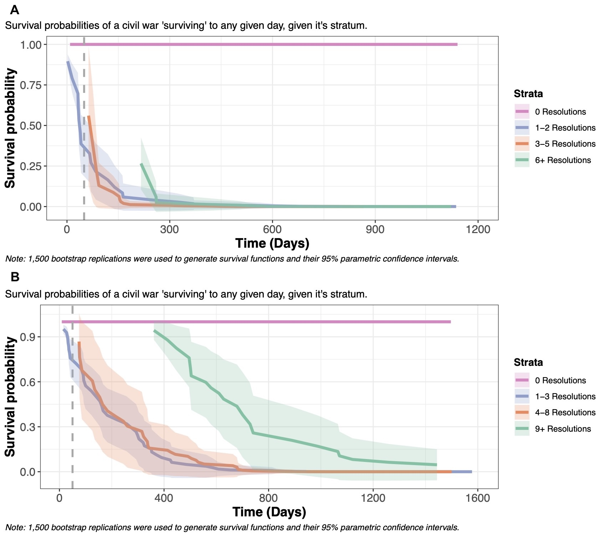
</div>

```{=html}
<details>
<summary>Code for creating duration data set</summary>
```
```{r}
#| label: UNSC-conflict-duration
#| eval: false
#######################################################################
#######################################################################
############ Creation of data set for resolutions and civil wars ######
#######################################################################
#######################################################################

### Clean R environment 
rm(list = ls())


### Packages used 
library(tidyverse) # Manipulation of data
library(data.table) # used to put data frames together
library(lubridate)


######################################################################################################
##############################################################################################
## 1. Creation of UN SC resolution data set
##############################################################################################
######################################################################################################


###### Begin with loading the original data set

## Specify path to the following data set: scc_ipi-scc-db-2.0_original.xlsx
UN_SC_file_dest <- "path/to/scc_ipi-scc-db-2.0_original.xlsx"

## Read the .xlsx file
data_res <-  readxl::read_xlsx(UN_SC_file_dest, col_names = TRUE,
                           col_types = "guess")


###### Begin creating the data set for UN SC resolutions. 

## Selecting only variables of interest
data_res_selected <- data_res %>% select("1.2_res_number", "2.1.1_civil_war", "2.2_year_adopt", "1.4_date_adopt", "5.3.1_military", "5.3.2_humanitarian", "5.3.3_governence", "5.3.4_external", "5.3.5_cooperation_with_UN")

## Creating a categorical variable for the theme of the paragraph in the resolution 
data_res_selected <- data_res_selected %>% 
  mutate(Theme = if_else(`5.3.1_military` == 2, 1, if_else(`5.3.2_humanitarian` == 2, 2, if_else(`5.3.3_governence` == 2, 3, if_else(`5.3.4_external` == 2, 4, if_else(`5.3.5_cooperation_with_UN` == 2, 5, -9))))))

## Creating year variable 
data_res_selected$Year <- str_sub(data_res_selected$`2.2_year_adopt`, start = 1, end = 4)

## Creating country-year variable for group_by 
data_res_selected$country_year <- str_c(data_res_selected$`2.1.1_civil_war`, data_res_selected$Year)

## Creating country-year-theme variable for group_by 
data_res_selected$country_year_theme <- str_c(data_res_selected$country_year, data_res_selected$Theme)

## Creating country-date_of_adoption-resolution_number variable for group_by
data_res_selected$country_date_res <- str_c(data_res_selected$`2.1.1_civil_war`, data_res_selected$`1.4_date_adopt`) 

data_res_selected$country_date_res <- str_c(data_res_selected$country_date, data_res_selected$`1.2_res_number`)

## Creating country-year-theme variable for group_by 
data_res_selected$country_year_res_theme <- str_c(data_res_selected$country_date_res, data_res_selected$Theme)

###### Time for manipulating the data_res_selected data frame so it is possible to see how many paragraphs a civil war got per year, 
###### and another data set where each rows is when a civil got a resolution, and the proportion concerning the theme.
###### We will first begin with data set for a year

## Use a group_by and create a counting variable for number of paragraphs that year and another variable for the proportion 
data_res_grp_year <- data_res_selected %>% 
  group_by(country_year_theme, country_year, Year, `2.1.1_civil_war`, Theme) %>% 
  count() %>% 
  group_by(country_year) %>% 
  mutate(total_par = sum(n), prop = n/sum(n)) %>% rename(Country = `2.1.1_civil_war`)

## Give the categories in the factor variable labels  
data_res_grp_year$Theme <- factor(data_res_grp_year$Theme, levels = c(1:5), labels = c("Military_conduct", "Humanitarian", "Governence", "External", "Cooperation_with_UN"))

## Remove variables 
data_res_grp_year <- data_res_grp_year[,-c(1:2)]

## Go from a long format to a wide format 
data_res_wider_year <- data_res_grp_year %>% 
  pivot_wider(id_cols = c(Year, Country, total_par), names_from = Theme, values_from = prop, values_fill = 0)


###### Create a plot of how the often the different paragraph themes are used over time 
data_res_plot <- data_res_grp_year %>% 
  group_by(Year, Theme) %>% 
  summarize(total_th = sum(n))

ggplot(data = data_res_plot, aes(x = Year, y = total_th, color = Theme)) + geom_line(aes(group = Theme)) + geom_point() +
  labs(y = "Theme of para") + theme_bw()


###### Now it is time for a data set where every row is resolution aimed at a civil war. 
###### Therefore where can be multiple resolution for a civil war the same year

## Create a data set where it is group by  country-year-theme-resolution_number among others
data_res_grp <- data_res_selected %>% 
  group_by(country_year_res_theme, country_date_res, `1.2_res_number`, `1.4_date_adopt`, `2.1.1_civil_war`, Theme) %>% 
  count() %>% group_by(country_date_res) %>%
  mutate(total_par = sum(n), prop = n/sum(n)) %>% 
  rename(Country = `2.1.1_civil_war`, date_adopt = `1.4_date_adopt`, res_num = `1.2_res_number`)


## Give the categories in the factor variable labels  
data_res_grp$Theme <- factor(data_res_grp$Theme, levels = c(1:5), labels = c("Military_conduct", "Humanitarian", "Governence", "External", "Cooperation_with_UN"))


## Creates a year variable 
data_res_grp$Year <- year(data_res_grp$date_adopt)

## Remove variables
data_res_grp <- data_res_grp[,-c(1:2)]


## Go from a long format to a wide format 
data_res_wider <- data_res_grp %>% 
  pivot_wider(id_cols = c(Year, date_adopt, Country, total_par, res_num, ), names_from = Theme, values_from = prop, values_fill = 0) 


######################################################################################################
######################################################################################################
## 2. Creation correlates of war civil war data set
######################################################################################################
######################################################################################################


###### Begin with loading the original data set

## Specify path to the following file: INTRA-STATE WARS v5.1 CSV.csv
COW_file_dest <-  "path/to/INTRA-STATE WARS v5.1 CSV.csv"

## Read the file
data_cw <- read_csv(COW_file_dest)

###### Manipulation of data set for civil wars

## Choose only civil wars that began in a period between 1989 and 2006
data_cw_periode <- data_cw %>% 
  filter(StartYr1 >= 1989 & StartYr1 <= 2006)

## Choose only civil wars between state and non state actor 
data_cw_periode <- data_cw_periode %>% 
  filter(!(CcodeA == -8))

## Creation the Regex expression that "catches" the start and end year of an civil war as combined group
pattern <- "([0-9-]+)$" # perl=TRUE 

## Creation the Regex expression that "catches" the start and end year of an civil war as to separate groups
pattern_2 <- "([0-9]+)-([0-9]+)|([0-9]+)" # perl=TRUE

## Creation of data set with a variable that includes both start and end year, and a variable that is a list of the start and end year
data_cw_year <- data_cw_periode %>% 
  mutate(year = str_extract(WarName, pattern)) %>% 
  group_by(WarName) %>% 
  mutate(year_list = str_match_all(year, pattern_2)) %>% 
  ungroup()

## For-loop that creates a row for every year a civil war lasted

# First make an empty list for data frames
df_list = list()  

# Takes every civil war in the data set
for (CW in 1:NROW(data_cw_year)) { 
  
  # Create a sub data frame that only has one civil war
  df_sub <- as.data.frame(data_cw_year[CW,])
  
  # If the civil war spans over multiple year create separate rows for every year. Otherwise just take the year the war lasted. 
  if (is.na(df_sub$year_list[[1]][4])) {
    df_sub <- df_sub %>% transform(year_seq = seq(as.numeric(year_list[[1]][2]), as.numeric(year_list[[1]][3])))
  } else {
    df_sub$year_seq <- as.numeric(df_sub$year_list[[1]][1])
  }
  
  # Put the new data frame in a list
  df_list[[(length(df_list) + 1)]] <- df_sub
}

## Concatenate all the data sets in the list into one data frame. This achieves the overall goal of getting every year in a civil war as a row. 
df_full_civil <- df_list %>% 
  rbindlist(fill = TRUE) %>% 
  as.data.frame


## Make a date variable for the start date for the civil war 
df_full_civil <- df_full_civil %>% mutate(date_start = make_datetime(StartYr1, StartMo1, StartDy1))


######################################################################################################
######################################################################################################
## 3. Creation of a merged data set between the resolution data set and correlates of war data set
######################################################################################################
######################################################################################################

## Function that remove NA for desired variable 
completeFun <- function(data, desiredCols) {
  completeVec <- complete.cases(data[, desiredCols])
  return(data[completeVec, ])
}

## Converts the year variable in the resolution wide format to a numeric class variable 
data_res_wider$Year <- as.numeric(data_res_wider$Year)

## Creates a dummy variable for the resolution data set that indicates  if the the civil war got a resolution
data_res_wider$res_bo <- 1 

#########
## Before merging we have to check if country names in the two data sets are the same 
#########

## Looking if the name of the place of the civil is the same in to two datasets
in_cw <- sort(unique(df_full_civil$SideA))
in_res <- sort(unique(data_res_wider$Country))
setdiff(in_cw, in_res)
setdiff(in_res, in_cw)
intersect(in_cw, in_res)

data_res_wider$Country <- fct_recode(data_res_wider$Country, "Bosnia" = "Bosnia Herzegovina", 
                                   "Cote d'Ivoire" = "Côte d'Ivoire",
                                   "Yugoslavia" = "FR Yugoslavia",
                                   "Yugoslavia" = "SFR Yugoslavia")

## Looking if the name of the place of the civil is the same in to two datasets
in_cw <- sort(unique(df_full_civil$SideA))
in_res <- sort(unique(data_res_wider$Country))
setdiff(in_cw, in_res)
setdiff(in_res, in_cw)
intersect(in_cw, in_res)


## Creates the final data that is a product of the resolution data set and the civil war data set that is merged together based upon the country and year variable. 
df_join <- left_join(df_full_civil, data_res_wider, by = c("SideA" = "Country", "year_seq" = "Year"))

## Converts the NA values in the resolution variable to zero
df_join$res_bo[is.na(df_join$res_bo)] = 0

## Table of how many observations that are in each category
table(df_join$res_bo, useNA = "ifany")

## Removes observations that is missing on the war name column
df_join <- completeFun(df_join, "WarName")

## Creating new res var that is 1 if a civil war experienced any resolutions in it's period
## or 0 if it has not experienced any at all
df_join <- df_join %>% group_by(WarName) %>% 
  mutate(treat_res = if_else(any(res_bo == 1), 1, 0))
######################################################################################################
######################################################################################################
## 4. Creation of a counting process data set for the extended cox model
######################################################################################################
######################################################################################################


## Make a new data frame that only contains selected columns and filter for missing values in the WarName column
df_pre_cox <- df_join[,-c(9:32)]
df_pre_cox <- df_pre_cox %>% 
  select(-c()) %>%
  filter(is.na(WarName)==FALSE)

## Making sure that resolutions come before the civil war begins
df_pre_cox$before_bo <- if_else(!(is.na(df_pre_cox$date_adopt)), df_pre_cox$date_start <= df_pre_cox$date_adopt, TRUE)
df_pre_cox <- df_pre_cox %>% filter(before_bo == TRUE)

## Adding one day to resolutions that come on the same day
df_pre_cox <- df_pre_cox %>% 
  mutate(date_res_lead = lead(date_adopt))

df_pre_cox$bo_ <- df_pre_cox$date_adopt == df_pre_cox$date_res_lead

df_pre_cox <- df_pre_cox %>% mutate(date_adopt = if_else(bo_ == TRUE, date_adopt + days(1), date_adopt))

summary(df_pre_cox$date_adopt == df_pre_cox$date_res_lead)

df_pre_cox$date_res_lead <- NULL

## Creates a boolean variable if observations is duplicates 
df_pre_cox$dup <-  duplicated(select(df_pre_cox, -year_seq))


## Creation of a new data frame that is a counting process form so that every time a resolution is introduced the counting process [start, stop] is reset
df_cox = df_pre_cox %>% #filter(WarName == "Sixth Iraqi Kurds War of 1991") %>%
  filter(dup == FALSE) %>% # Filters for duplicates
  arrange(WarName, date_start, date_adopt) %>% # Sorts the data frame by WarName, date_start and data_adopt
  group_by(WarName) %>% # Group_by for WarName aka. civil war
  mutate(lead_date = lead(date_adopt), # Creates a lagged variable based upon the adoption of a resolution
         lead_date = if_else(is.na(lead_date)==TRUE,as.Date(date_start + days(WDuratDays)),as.Date(lead_date)), # If where is a NA value in the lagged variable when code it as the date for the end of the civil war
         diff_time = if_else(res_bo == 0, WDuratDays, as.numeric(difftime(date_adopt, date_start, units = "days")))) %>% # Creates a variable called diff_time that is the difference between the beginning of the civil war and the date for the adoption of the resolution
  filter(diff_time >= 0) %>% filter(diff_time <= WDuratDays) %>% # Keeps only observations where a resolution has been adopted after the beginning of a civil war and before the end of the of the civil war
  mutate(stop = cummax(diff_time), # Creates a stop variable that indicates the end of a civil war in days and furthermore the end day of a resolution in a civil war
         start = lag(stop, default = 0)) %>% # Creates a stop variable that indicates the beginning of a civil war in days and afterwards the day after a resolution in a civil war
  select(start,stop,everything())


## Because stop and start time cannot be the same we are looking 
View(filter(df_cox, !(stop > start)))

# We found one problem with the dafur rebellion that was deleted
# Making sure that the end day of a war is bigger when the start 
df_cox$SS_bo <- df_cox$stop > df_cox$start
df_cox <- df_cox %>% filter(SS_bo == TRUE)


### 
# Creating a variable that counts which resolution it is in a series of resolutions 
###

df_cox <- df_cox %>%
  group_by(WarName) %>%
  mutate(agg_res = if_else(res_bo == 0, 0, cumsum(res_bo))) %>% ungroup()

## Binning it 
table(df_cox$agg_res)

df_cox$agg_res_cat <- factor(df_cox$agg_res)
df_cox$agg_res_cat <-  fct_collapse(df_cox$agg_res_cat, "0" = c("0"),
                                    "1" = c("1", "2"),
                                    "2" = c("3", "4", "5"),
                                    "3" = c("6", "7", "8", "9", "10", "11",
                                            "12", "13", "14", "15", "16", "17",
                                            "18", "19", "20", "21", "22", "23",
                                            "24", "25", "26", "27", "28", "29",
                                            "30", "31", "32", "33"))    


df_cox_co <- df_cox
```

</details>